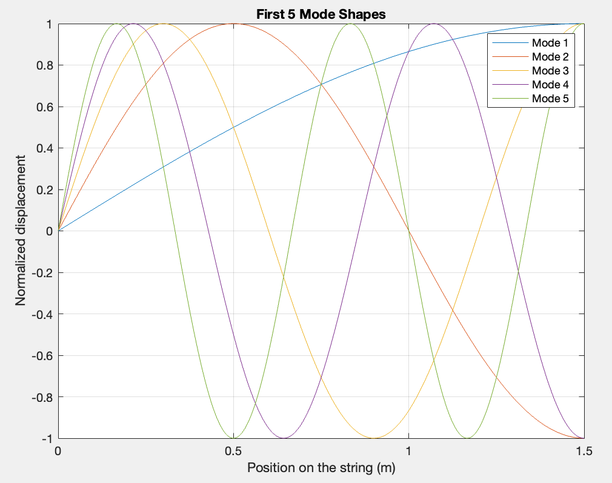
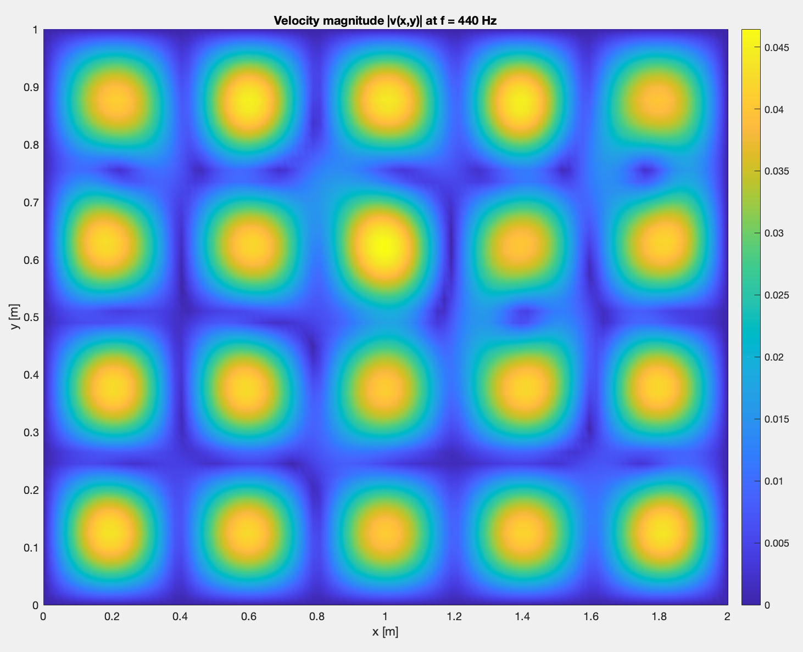
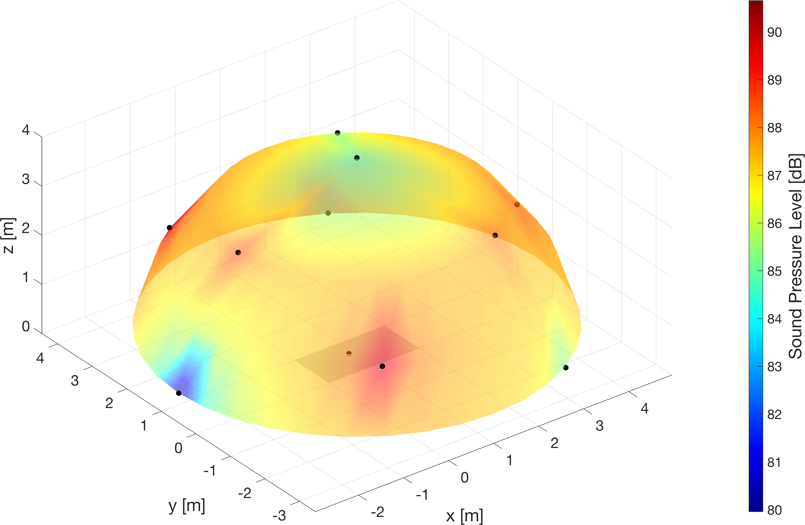

# Vibroacoustics and Sound Radiation

Documentation-focused case study on analytical vibroacoustic modelling, from string and plate vibration to acoustic sound-radiation prediction.

This repository documents a three-part academic project developed within the Master's Degree in Music and Acoustic Engineering at Politecnico di Milano. The work models a coupled mechanical-acoustic system inspired by musical-instrument structures: a tensioned string transfers dynamic excitation to a thin plate, and the vibrating plate radiates sound into a surrounding acoustic field.

The repository is intended as a technical portfolio case study, not as a standalone software package. It includes curated reports and selected figures, while the original computational source files are not included.

## Project Scope

The project is organised into three connected stages:

1. **Transverse vibration of a tensioned string**  
   Analytical modelling of a string subsystem with elastic and damping boundary conditions, natural-frequency estimation, mode-shape visualisation, driving-point and transfer receptance, and reaction-force estimation.

2. **Bending vibration of a simply supported thin plate**  
   Kirchhoff-Love plate modelling, computation of natural frequencies and mode shapes, modal superposition, point and transfer mobility, and vibration-velocity mapping at 440 Hz.

3. **Sound radiation from a vibrating plate**  
   Acoustic pressure prediction using a Kirchhoff-Helmholtz / Green's-function formulation, SPL estimation over one-third-octave bands, and hemispherical radiation visualisation for virtual microphone positions.

## Methods

### String vibration

The first stage uses the one-dimensional transverse wave equation for a tensioned string. The analysis applies boundary conditions including an elastic constraint and damping contribution, then solves the frequency-domain system to estimate resonances and receptance functions.



### Plate vibration

The second stage uses Kirchhoff-Love thin-plate theory for a simply supported rectangular plate. Natural frequencies and mode shapes are computed, and the plate response is reconstructed through modal superposition. Point and transfer mobility are then evaluated to describe dynamic coupling and vibration-energy transmission.



### Sound radiation

The final stage estimates the sound pressure radiated by the vibrating plate mounted in an infinite rigid baffle. The radiated field is computed from the normal velocity distribution through a free-field Green's function formulation. SPL values are evaluated in one-third-octave bands and visualised over a hemispherical receiver arrangement.



## Tools and Technologies

- Analytical vibroacoustic modelling
- Modal analysis and modal superposition
- Frequency-response and mobility analysis
- Kirchhoff-Love thin-plate theory
- Kirchhoff-Helmholtz / Green's-function sound-radiation formulation
- One-third-octave SPL analysis
- MATLAB-based numerical evaluation and plotting
- LaTeX technical reporting

## Repository Structure

```text
vibroacoustics-sound-radiation/
  README.md
  AUTHORS.md
  NOTICE.md
  docs/
    reports/
      transverse_string_vibration_report.pdf
      thin_plate_bending_vibration_report.pdf
      plate_sound_radiation_report.pdf
  assets/
    figures/
      string_vibration/
      plate_dynamics/
      sound_radiation/
```

## Reports

| Report | Content |
|---|---|
| [`transverse_string_vibration_report.pdf`](docs/reports/transverse_string_vibration_report.pdf) | Natural frequencies, mode shapes, driving-point/transfer receptance, and reaction force of the tensioned string subsystem. |
| [`thin_plate_bending_vibration_report.pdf`](docs/reports/thin_plate_bending_vibration_report.pdf) | Kirchhoff-Love plate vibration, modal response, mobility functions, and vibration velocity field at 440 Hz. |
| [`plate_sound_radiation_report.pdf`](docs/reports/plate_sound_radiation_report.pdf) | Acoustic pressure prediction, one-third-octave SPL estimation, microphone-array configuration, and hemispherical radiation patterns. |

## Key Results

- Identified natural frequencies and mode shapes of a tensioned string with non-ideal boundary conditions.
- Computed driving-point and transfer receptance functions, highlighting resonant peaks and phase transitions.
- Estimated the reaction force transmitted from the string subsystem to the plate.
- Modelled simply supported thin-plate bending modes using Kirchhoff-Love theory.
- Computed point and transfer mobility functions to interpret vibration-energy transmission across the plate.
- Reconstructed the plate velocity field at 440 Hz, identifying the dominant spatial vibration pattern.
- Estimated acoustic pressure radiated by the vibrating plate using a Green's-function-based formulation.
- Evaluated SPL at virtual hemispherical microphone positions in one-third-octave bands.
- Compared low-frequency radiation patterns, showing more uniform behaviour at 250 Hz and stronger spatial variation at 500 Hz.

## Authorship

This was an academic group project developed by Francesco Bandera and Anna Impembo. The repository presents the work as a collaborative technical case study.
